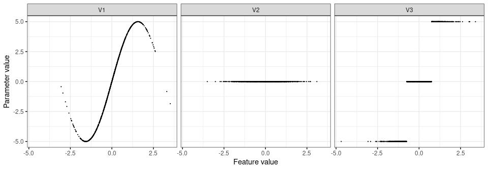
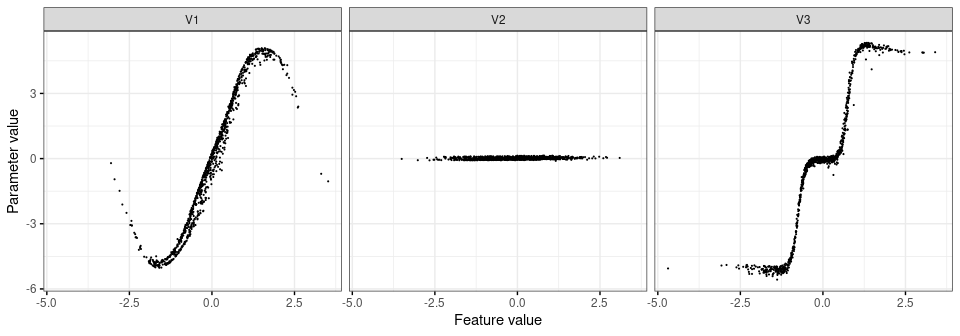
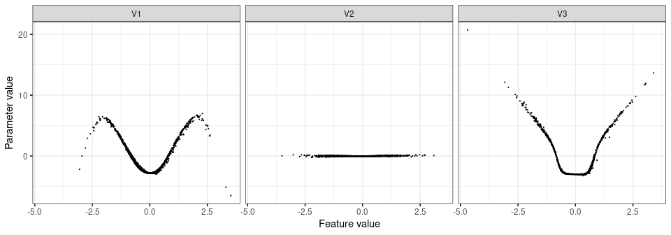
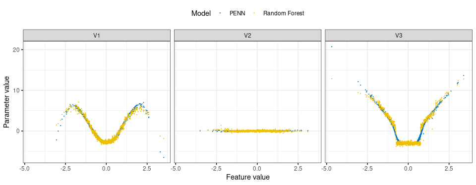

README
================

A **Parameter Encoder Neural Network (PENN)** is an explainable machine
learning technique that solves two problems associated with traditional
XAI algorithms:

1.  It permits the calculation of local parameter distributions.
    Parameter distributions are often more interesting than feature
    contributions — particularly in economic and financial applications
    — since the parameters disentangle the effect from the observation
    (the contribution can roughly be defined as the demeaned product of
    effect and observation).
2.  It solves a problem of biased contributions that is inherent to many
    traditional XAI algorithms. Particularly in the setting where neural
    networks are powerful — in interactive, dependent processes —
    traditional XAI can be biased, by attributing effect to each feature
    independently.

At the end of the tutorial, I will have estimated the following highly
nonlinear parameter functions for a simulated regression with three
variables:

<!-- -->

## Preliminaries

For more details on the mathematical background of the parameter encoder
neural network, see the [paper](https://arxiv.org/abs/2106.05536). An
`R` version of this tutorial can be found
[here](https://github.com/jpfitzinger/penn-for-r).

## Example data

We will use a nonlinear simulated data set with `k = 3` features
contained in the array `x` and a continuous target `y` given by
`y = x[1]*beta[1] + x[2]*beta[2] + x[3]*beta[3] + error`. Here `beta[1]`
has the shape of a sine-curve, `beta[2]` has no effect on the output
(i.e. this is simply a correlated nuisance term), and `beta[3]` has a
threshold shape with 3 different regimes:

``` python
import numpy as np

# For reproducibility
np.random.seed(42)

k = 3
n = 1000

Sigma = [[1.0, 0.3, 0.3], [0.3, 1.0, 0.3], [0.3, 0.3, 1.0]]
x = np.random.multivariate_normal([0.0]*k, Sigma, n)
eps = np.random.normal(size=n)
betas = np.zeros((n,k))
betas[:,0] = np.sin(x[:,0]) * 5.0
betas[x[:,2]>0.75,2] = 5.0
betas[x[:,2]<-0.75,2] = -5.0
y = (x * betas).sum(axis=1) + eps
```

## Building a Parameter Encoder NN from scratch

The following code chunks construct a PENN model using `keras` to
estimate `beta`. The separate functions are combined into a `PENN` class
in `PENN.py`. I begin by loading the necessary modules below:

``` python
# Load backend functions
from keras import backend as b

# Neural net building blocks
from keras.layers import Dense, Input, Lambda, Multiply, Add
from keras.regularizers import l2
from keras.optimizers import Adam
from keras import Model

# Necessary for the calculation of the beta-prior
from scipy.spatial import distance_matrix

import tensorflow as tf
# For the loss function to work, we need to switch off eager execution
tf.compat.v1.disable_eager_execution()
# For reproducibility
tf.random.set_seed(42)
```

Next, I construct the inference network with 2 layers and 10 hidden
nodes in each layer. I use a sigmoid activation function. The inference
network is completed by the output nodes for the parameter
distributions, `mu` and `sigma`. The PENN uses variational inference to
obtain posteriors of the local parameters. Assuming normally distributed
local parameters, `mu` and `sigma` parameterize the local posteriors. A
prediction is generated by sampling from the posterior:

``` python
def build(k, n, mc_draws=100, size=10, l2_penalty=0.001):
    
    # 1. Model inputs
    
    input_inference_nn = Input(k, name='input_inference_nn')
    input_model = Input(k, name='input_model')
    input_knn_prior = Input(batch_shape=(n, n), name='input_knn_prior')
    input_mc = Input(tensor=b.random_normal((n, mc_draws, k)), name='input_mc')
    inputs = [input_inference_nn,
                   input_model,
                   input_knn_prior,
                   input_mc]
    
    # 2. Inference Network

    encoder_layer_1 = Dense(size,
                                 activation='sigmoid',
                                 kernel_regularizer=l2(l2_penalty))(input_inference_nn)
    encoder_layer_2 = Dense(size,
                                 activation='sigmoid',
                                 kernel_regularizer=l2(l2_penalty))(encoder_layer_1)

    # ---- Parameter layers
    mu = Dense(k, kernel_regularizer=l2(l2_penalty), name='mu')(encoder_layer_2)
    sigma_squared = Dense(k, activation='exponential', 
                          kernel_regularizer=l2(l2_penalty))(encoder_layer_2)
    sigma = Lambda(lambda i: b.sqrt(i), name='sigma')(sigma_squared)

    # 3. Posterior sample
    
    sample = Multiply()([sigma, input_mc])
    sample = Add()([sample, mu])

    # 4. Generate predictions
    
    output = Multiply()([sample, input_model])
    output = Lambda(lambda i: b.sum(i, axis=2, keepdims=True), output_shape=(n, mc_draws, 1))(output)

    # 5. Build model
    
    model = Model(inputs, output)

    return model
```

With the model function defined, I can build the PENN model, as well as
supporting models (used only for inference) that extract the parameters
of the posterior:

``` python
model = build(k, n)

mu_model = Model(model.inputs, model.get_layer('mu').output)
sigma_model = Model(model.inputs, model.get_layer('sigma').output)
```

The most important component of the PENN is the loss function, which we
define next. The loss function consists of two elements: the mean
squared error of the local linear model, and a Kullback-Leibler penalty
enforcing stability in the parameter distributions:

``` python
def loss(y, y_pred):
    mse = b.mean(b.square(y_pred - y))
    mu_ = model.get_layer('mu').output
    sigma_ = model.get_layer('sigma').output
    input_knn_prior_ = model.inputs[2]
    prior_mu = b.dot(input_knn_prior_, mu_)
    prior_sigma = b.dot(input_knn_prior_, sigma_) + b.dot(input_knn_prior_, b.square(mu_ - prior_mu))

    kl = b.mean(b.mean((b.log(b.sqrt(sigma_)) -
                        b.log(b.sqrt(prior_sigma))) -
         ((sigma_ + b.square(mu_ - prior_mu)) / (2 * prior_sigma)) + 0.5, axis=1))

    return mse - kl * lam
```

Finally, the KNN-prior requires a distance matrix, and we need to set
hyperparameters:

``` python
lam = 4
gam = 0.04

knn_prior = distance_matrix(x, x)
gam = knn_prior[knn_prior>0.0].min() + gam * (
    knn_prior[knn_prior > 0.0].max() - knn_prior[knn_prior>0.0].min()
)
knn_prior /= gam
idx = knn_prior < 1.0
knn_prior[idx] = 1.0
knn_prior[~idx] = 0.0
knn_prior = (knn_prior.T / knn_prior.sum(axis=1)).T
```

With all the components in place, we can compile and fit the model:

``` python
model.compile(loss=loss, optimizer=Adam(learning_rate=0.05, clipnorm=1, clipvalue=0.5))

data = {
    'input_inference_nn': x,
    'input_model': x,
    'input_knn_prior': knn_prior,
    'input_mc': np.zeros((n, 100, k))
}
# Note that y needs to be expanded over the sampling dimension (we are sampling 100 draws)
y_expanded = np.repeat(y[:, np.newaxis, np.newaxis], 100, axis=1)

model.fit(data, y_expanded, batch_size=n, epochs=1000, verbose=0)
```

    ## <keras.callbacks.History object at 0x7f52684b4df0>

We can extract the estimated parameters using the inference models:

``` python
mu = mu_model.predict(data, batch_size=n)
```

Let’s plot the posterior means against the values of `x`:

<!-- -->

…and the true parameters of the simulation against `x`:

<!-- -->

That looks pretty good!

## Comparing to `shap`

An interesting question is how the explanations obtained from the PENN
model compare with SHAP values. SHAP values are contributions, which we
can obtain from the estimated parameters:

``` python
phi = mu * x
phi = phi - phi.mean(axis=0)
```

Plotting the contributions:

<!-- -->

Now, I fit a random forest regressor on the data using sklearn:

``` python
from sklearn.ensemble import RandomForestRegressor
mod = RandomForestRegressor(n_estimators=100)
mod.fit(x, y)
```

    ## RandomForestRegressor()

The feature contributions can be obtained using `shap.TreeExplainer`:

``` python
import shap
expl = shap.TreeExplainer(mod)
phi_shap = expl.shap_values(x, y)
```

The plot below displays the Random Forest and PENN contributions, which
match closely, as is to be expected in the case of independent features:

<!-- -->
